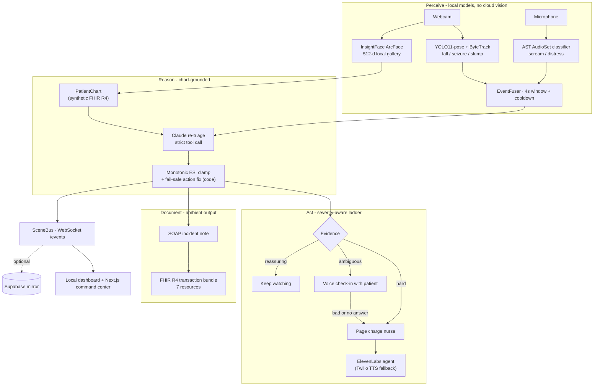

# Vigil 🏆 - Finalist (Top 6 of 115), Anthropic x Lightspeed x Abridge Hackathon

**An always-on, identity-aware re-triage agent for the emergency waiting room.**

[](tests)
[](pyproject.toml)
[](vigil/reasoning)
[](vigil/perception)
[](vigil/escalation)
[](vigil/documentation)
[](LICENSE)

A patient is triaged once, then waits. Vigil watches the hours after that snapshot: a camera and microphone run pose, distress-audio, and face-recognition models locally, a sliding-window fuser turns raw signals into evidence, and Claude re-scores the patient's Emergency Severity Index against their own synthetic FHIR chart. When urgency rises, Vigil speaks to the patient, calls the charge nurse with a chart-grounded summary, and writes the incident out as a SOAP note and a FHIR R4 transaction bundle. Safety-critical rules - the monotonic ESI clamp, the fail-safe on API failure - live in code, never in a prompt.

---

## How It Works

One incident travels the whole system in a few seconds:

1. **Perception.** A webcam runs **YOLO11-pose + ByteTrack** and a microphone runs an **Audio Spectrogram Transformer** fine-tuned on AudioSet. Each raises discrete `PerceptionEvent`s: `fainted`, `seizure`, `scream`, `slump`.
2. **Identity.** **InsightFace/ArcFace** embeds the largest visible face on device and matches it against a local gallery of 512-d vectors, pulling up the right synthetic chart automatically. No images stored, nothing uploaded.
3. **Fusion.** The `EventFuser` holds a 4-second sliding window and a cooldown. A scream *and* a fall together is a far stronger emergency than either alone, and the cooldown stops one event re-firing every frame. Out comes a severity-tagged `FusedEvent`.
4. **Reasoning.** Claude re-triages the fused event against the chart - conditions, medications, latest vitals, prior ESI - through a single strict tool call, returning prior ESI, proposed ESI, evidence, action, and a spoken nurse summary.
5. **Safety clamp.** Code, not the model, enforces that the ESI may only get *more* urgent, and corrects the action if the model's action and its own severity disagree. An API failure fails safe rather than silently holding.
6. **Escalation ladder.** Hard evidence pages the nurse now. Ambiguous evidence talks to the **patient** first over an ElevenLabs voice agent and pages a human only on a bad or absent answer. Reassuring evidence keeps watching.
7. **Documentation.** The completed incident writes a SOAP note plus a seven-resource FHIR R4 transaction bundle to `data/incidents/`, and the whole trace streams to a live dashboard over WebSocket.

The thesis is simple: triage is a snapshot, a waiting room is a timeline. Vigil watches the gap.

---

## Architecture



Everything is organized around one chain of typed contracts: `PerceptionEvent` → `FusedEvent` → `TriageDecision` → `EscalationAction` → `BusEvent`. Every component either produces or consumes one of them, so the ladder, the documentation layer, and the dashboards are all testable without a camera in the room.

---

## Pipeline and Components

| Component | Role | Technology |
|---|---|---|
| `perception/vision.py` | Pose tracking → fall, seizure, slump, motionless events | Ultralytics YOLO11-pose + ByteTrack + OpenCV |
| `perception/audio.py` | Microphone → scream and distress events | AST (`MIT/ast-finetuned-audioset`), loudness fallback |
| `perception/faces.py` | Bind the person on camera to their chart | InsightFace ArcFace, 512-d local gallery, onnxruntime |
| `perception/fusion.py` | Sliding-window correlation, severity tagging, cooldown | Pure Python, fully unit-tested |
| `chart.py` | Synthetic FHIR record → compact `PatientChart` | Abridge synthetic dataset |
| `reasoning/triage.py` | Chart-grounded ESI re-triage + code-enforced safety | Claude via strict tool call |
| `reasoning/initial_triage.py` | First ESI from a spoken intake, ESI v4 decision tree | Claude, fails safe to ESI 2 |
| `reasoning/voice_intake.py` | Spoken intake → transcript | ElevenLabs Scribe STT |
| `escalation/ladder.py` | Hold, patient check-in, or page - injected call handlers | Pure policy, no vendor coupling |
| `escalation/elevenlabs_call.py` | Live outbound calls, check-in transcript grading | ElevenLabs conversational agent |
| `escalation/twilio_call.py` | Direct TTS fallback when the agent is unavailable | Twilio |
| `documentation/abridge_note.py` | SOAP note + FHIR R4 transaction bundle | Claude, deterministic fallback |
| `server/` | Orchestration, WebSocket fan-out, MJPEG video, live status | FastAPI + Uvicorn |
| `tuning/` | Closed-loop optimizer for every threshold in the system | Offline eval + annealed search |

---

## Repo Structure

```
vigil/
  config.py              Environment-driven models, credentials, thresholds
  events.py              Typed contracts passed through the whole pipeline
  chart.py               Synthetic FHIR data -> compact PatientChart
  perception/
    vision.py            YOLO pose + ByteTrack -> fall/seizure/slump events
    audio.py             Microphone -> AST scream/distress events
    fusion.py            Signals -> severity-tagged FusedEvent
    faces.py             Local ArcFace embeddings -> patient identity
  reasoning/
    prompts.py           Conservative re-triage policy + strict output schema
    triage.py            Claude re-triage + code-enforced ESI safety rules
    initial_triage.py    First ESI from intake (ESI v4 tree, fail-safe)
    voice_intake.py      ElevenLabs Scribe speech-to-text
  escalation/
    ladder.py            Hold, patient check-in, or immediate nurse call
    elevenlabs_call.py   Outbound calls + check-in transcript evaluation
    twilio_call.py       Direct Twilio TTS fallback
  documentation/
    abridge_note.py      SOAP note + FHIR R4 transaction bundle
  server/
    app.py               FastAPI orchestration and endpoints
    bus.py               WebSocket fan-out + isolated video frame buffer
    status.py            Live patient state exposed to the voice agent
    supabase_sink.py     Optional remote event mirror
  tuning/                Closed-loop optimizer for vision/audio/fusion/face/reasoning
  dashboard/index.html   Live patient, reasoning, call, and note interface
scripts/                 Cohort extraction, face enrollment, calibration, tuning, preflight
web/                     Next.js/Vercel command center
supabase/schema.sql      Remote observability event table
tests/                   Fusion, escalation, ESI, vision, call-gate, and FHIR safety tests
```

---

## Quick Start

Requires Python 3.12+, [`uv`](https://docs.astral.sh/uv), a webcam, and a microphone. Development was done on MacBooks.

```bash
git clone https://github.com/PranavAchar01/Vigil-AnthropicxLightspeedxAbridge-Hackathon.git
cd Vigil-AnthropicxLightspeedxAbridge-Hackathon
uv sync
cp .env.example .env
```

1. **Set your keys** in `.env`: `ANTHROPIC_API_KEY` for reasoning, and `ELEVENLABS_API_KEY` / Twilio credentials if you want real outbound calls.
2. **Build the demo cohort.** Point `VIGIL_DATASET_PATH` at the Abridge synthetic FHIR JSONL file, then:
   ```bash
   uv run python scripts/extract_demo_cohort.py
   ```
3. **Optional - enable face-to-chart identity:**
   ```bash
   uv sync --extra faces
   uv run python scripts/enroll_faces.py
   ```
4. **Check the machine is ready** (deps, secrets, cohort, models, tunnel config):
   ```bash
   uv run python scripts/preflight.py
   ```
5. **Run it:**
   ```bash
   uv run uvicorn vigil.server.app:app --port 8000
   ```
   Open <http://localhost:8000>. Use **one** Uvicorn worker - the event bus, frame buffer, and patient state are in-process.

### Configure the nurse call

```bash
export ELEVENLABS_API_KEY=sk_...
uv run python scripts/setup_elevenlabs.py create-agent
uv run python scripts/setup_elevenlabs.py import-number \
  --phone +1... --sid AC... --token ...
```

Put the resulting IDs and the charge nurse's demo number in `.env`:

```text
ELEVENLABS_AGENT_ID=...
ELEVENLABS_PHONE_NUMBER_ID=...
NURSE_PHONE_NUMBER=+1...
```

Never commit `.env` or real patient information. Secrets, the cohort, model weights, and the face gallery are all gitignored.

### Run the command center

```bash
cd web
pnpm install
pnpm dev
```

---

## Signals and the Escalation Ladder

The perception layer raises four real signals plus two UI-only provisional ones. Severity, not the model's opinion, picks the rung:

| Signal | Modality | Severity | Meaning |
|---|---|---|---|
| `fainted` | vision | hard | Went down and stayed down for 5s+ |
| `seizure` | vision | hard | Oscillatory convulsion sustained 5s+ |
| `scream` | audio | hard | AudioSet distress vocalization |
| `slump` | vision | soft | Sustained posture degradation |
| `fall_detected` | vision | UI only | Fall seen - 5s validation countdown running |
| `fall_cleared` | vision | UI only | Got back up before validating, no escalation |

| Rung | Trigger | What happens |
|---|---|---|
| `page_immediately` | Hard evidence, or a hard + soft fusion | Charge nurse is called now with a chart-grounded summary |
| `voice_checkin` | Ambiguous soft evidence | Vigil talks to the **patient** first; pages on a bad or absent answer |
| `hold` | Reassuring evidence | Keep watching, preserve the event history |

Two invariants are enforced in code and never delegated to the model: **ESI is monotonic** (because ESI 1 is most acute, the new number may only stay the same or go down), and a **reasoning failure fails safe** rather than quietly holding.

---

## Tech Stack

| Layer | Technology |
|---|---|
| Vision | Ultralytics YOLO11-pose, ByteTrack, OpenCV |
| Audio | Audio Spectrogram Transformer on AudioSet (Transformers), heuristic fallback |
| Identity | InsightFace ArcFace embeddings via onnxruntime, local only |
| Reasoning | Claude with strict tool-call schemas, code-enforced ESI safety rules |
| Voice | ElevenLabs conversational agent + Scribe STT, Twilio TTS fallback |
| Interop | FHIR R4 transaction bundles, Abridge synthetic dataset |
| Server | FastAPI, Uvicorn, WebSocket event bus, MJPEG video |
| Frontends | Local HTML dashboard, Next.js/Vercel command center |
| Observability | Optional Supabase event mirror |
| Tuning | In-repo closed-loop optimizer with deterministic offline evals |

---

## Server Interfaces

- `GET /` - live dashboard
- `GET /intake` - voice intake page
- `POST /intake` - upload spoken intake audio, get transcript and initial ESI
- `GET /health` - configured capabilities and active patient
- `GET /video` - MJPEG camera stream
- `WS /events` - real-time JSON event stream
- `GET /patients` - loaded demo cohort
- `POST /active/{patient_id}` - select the active demo patient
- `POST /pause` - pause and resume perception
- `GET /calibrate/metrics` - raw detector metrics for the calibration scripts
- `GET /agent/patient-status[/{patient_id}]` - token-protected live status for the voice agent
- `POST /webhooks/elevenlabs` - mirror completed call turns into the event log

---

## Capabilities and Graceful Degradation

Every layer is optional. Vigil starts with whatever is configured and says what is missing.

| Layer | Requirement | Behavior when unavailable |
|---|---|---|
| Cohort | `data/demo_cohort.json` | Server starts without an active patient |
| Reasoning | `ANTHROPIC_API_KEY` | Incident stops before clinical re-triage |
| Vision | Webcam + OpenCV/Ultralytics | Vision thread is disabled |
| Audio | Microphone + `sounddevice` | Audio thread is disabled |
| Audio ML | `uv sync --extra audio` | Falls back to a loudness/spectral heuristic |
| Face identity | `uv sync --extra faces` + enrolled gallery | Uses the manually selected active patient |
| Nurse call | ElevenLabs or Twilio credentials | Action is recorded as failed / not configured |
| SOAP note | `ANTHROPIC_API_KEY` | Deterministic chart-grounded fallback |
| FHIR | No external credentials | Bundle is written locally to `data/incidents/` |
| Remote feed | Supabase credentials | Local dashboard and event bus keep working |

---

## Tests

Forty-four offline tests cover the deterministic, safety-critical core: multimodal fusion and cooldown behavior, the escalation ladder, the monotonic ESI clamp, fail-safe action correction, initial-triage invariants, the call gate, fall and seizure geometry, and FHIR bundle shape.

```bash
uv run pytest tests
```

None of it needs a camera, a microphone, or a live API key - the parts that decide whether a nurse gets called are pure Python.

---

## Safety Rules

- **Clinical decision support, not diagnosis.** Vigil recommends attention; a clinician makes the medical decision.
- **Monotonic re-triage.** Vigil can add urgency but can never remove it, and the clamp is code, not a prompt.
- **Fail safe, not silent.** A reasoning API failure escalates and flags for review rather than assigning a low acuity.
- **Human in the loop.** Ambiguous or serious evidence brings a person in rather than autonomously acting on the patient.
- **Synthetic data only.** The demo cohort contains no real patient records.
- **Consent for identity.** Face enrollment is explicit and limited to the monitoring episode; only 512-d embeddings are stored, never images, and nothing is uploaded.
- **Honest perception limits.** Vigil detects a defined signal catalog plus anomalies. It does not claim to recognize every possible emergency.
- **Prototype status.** This is not a validated medical device and must not be used for real clinical care.

---

## Abridge Integration

Vigil extends the ambient documentation thesis across the whole incident, not just the visit:

- **Chart in.** Conditions, medications, demographics, and latest vitals from a synthetic FHIR R4 record ground the re-triage decision.
- **Ambient event in.** The waiting-room episode becomes a clinical event instead of disappearing before the patient reaches the front desk.
- **Note out.** A SOAP incident note plus the transcript.
- **FHIR out.** Encounter, ESI Observation, event Observation, SOAP DocumentReference, transcript DocumentReference, safety Flag, and nurse Communication, packaged as one transaction bundle linked to the patient. POST-ready; the demo writes it locally.

---

## Roadmap

- Persistent mapping of multiple camera track IDs to individual patient monitors
- Simultaneous monitoring of several patients with independent state per track
- Longer temporal baselines and a broader visual and audio event catalog
- Natural-language distress understanding ("I can't breathe")
- Multi-patient dashboard controls
- Optional submission of the generated bundle to a real FHIR endpoint

The current build is a single-participant demo: a recognized face can replace the active patient automatically, but pose observations are routed to that one active profile.

---

## Hackathon Contribution

Original work here: the fused visual/audio perception pipeline, the chart-grounded monotonic re-triage agent, the severity-aware patient-check-in and nurse-escalation ladder, dynamic chart-grounded ElevenLabs/Twilio calling, ambient SOAP documentation and FHIR incident packaging, the live reasoning dashboard, and the closed-loop tuner for every threshold in the system.

Pre-existing technologies: Ultralytics YOLO, ByteTrack, OpenCV, the AST AudioSet classifier, InsightFace, the Anthropic and ElevenLabs APIs, Twilio, FastAPI, and the provided synthetic FHIR dataset.

Built by [Sahiel Bose](https://github.com/sahielbose) and [Pranav Achar](https://github.com/PranavAchar01).

---

## License

[MIT](LICENSE) - built for the Anthropic x Lightspeed x Abridge Hackathon, *The Future of Agentic AI in Healthcare*.

**Vigil does not replace triage. It keeps triage from becoming stale.**
